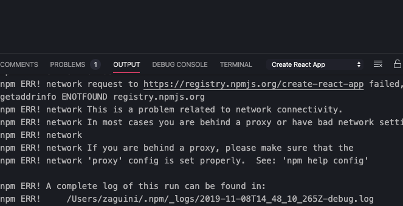

# [Create React App](https://marketplace.visualstudio.com/items?itemName=zaguini.create-react-app-vscode)

Easily create React apps using the [official boilerplate](https://github.com/facebook/create-react-app), directly from VSCode!

## Usage

Simply open the command palette and search for `Create React App` once you have the extension installed.

**Pro-tip: typing just `cra` works as well :-)**

### TypeScript support?

Included! You'll be prompted about it after entering the identifier for your app

---

## Troubleshooting

If you find any issues, please copy what's in the `output` tab on the `Create React App` task. Like this:

After copying, please file an issue with general information about your environment, like:

- OS
- VSCode version
- Desired folder (please check if you have permissions to write before filing the issue)
